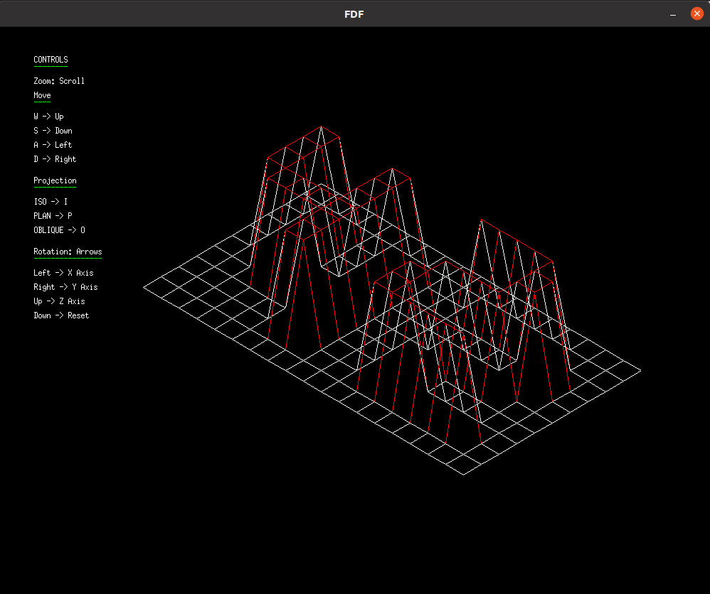
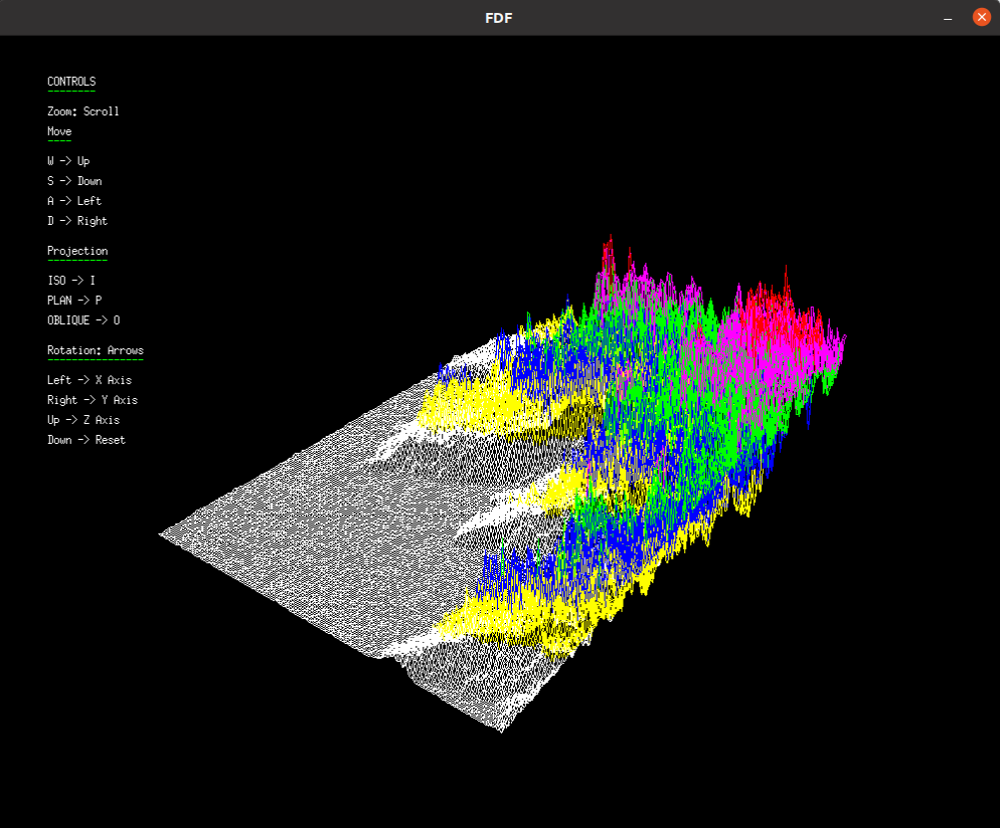

# 🖼️ FDF
This project is about creating a simplified graphic “wireframe” (“fils de fer” in French,
hence the name of the project) representation of a relief landscape linking various points
(x, y, z) via segments. The coordinates of this landscape are stored in a file passed as
a parameter to your program.
## ✔️ Features
- Differents colors which depends on height
- Rotation in 3 axis *(x,y,z)*
- Map traslation
- 3 kinds of perspectives *(Isometric, Planar, Oblique)*
- Zoom in/out
## 📖 Requirements
- Linux
- GCC
- X11
## 👌 Usage
1. Compile the project  `make` 🔄 `make bonus`
2. `./fdf test_maps/example.fdf`
## ⌨️ Controls 
### 🏃 Movement
- W ⬆️
- S ⬇️
- A ⬅️
- D ➡️
### 🔍 Zoom
- **Zoom in** -> *Scroll Up* ⏫
- **Zoom out** -> *Scroll Down* ⏬
### 👀 Perspective
- **Isometric** -> *I*
- **Planar** -> *P*
- **Oblique** -> *O*
### 🌍 Rotation
- X Axis ⬅️
- Y Axis ➡️
- Z Axis ⬆️
- Reset ⬇️
## 🖼 Screenshots

### Links 🔗
- [Computer Graphics Tutorial](https://www.javatpoint.com/computer-graphics-programs)
- [FDF Video Tutorial](https://www.youtube.com/watch?v=10P59aOgi68)
- [Minilibx Guide](https://qst0.github.io/ft_libgfx/man_mlx.html)
- [Minilibx Getting Started](https://harm-smits.github.io/42docs/libs/minilibx/getting_started.html)

